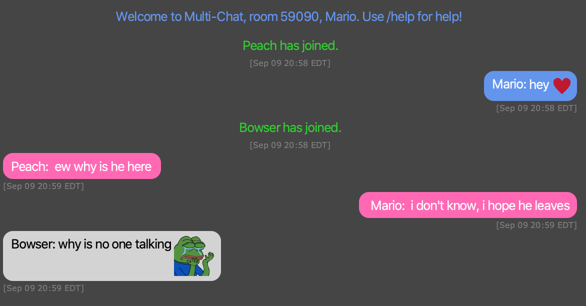
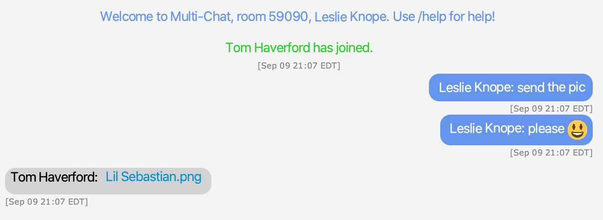
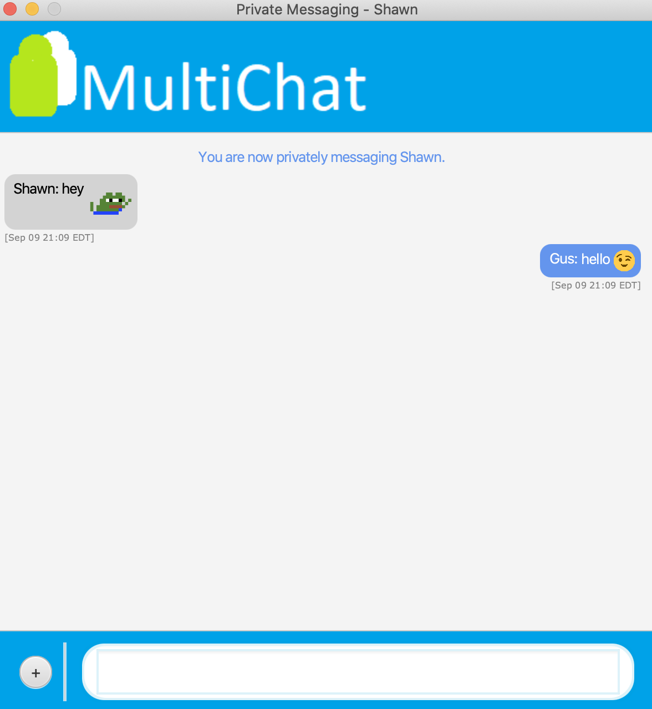

# MultiChat - A Chatting Application Using Java Sockets
## Installation
A guide on how to install MultiChat will be coming soon. 
## Usage
MultiChat comes with several fun features to make chatting a more enjoyable experience. 

### Emotes
Like many other chatting applications, MultiChat supports the use of emojis in messages. However, what sets MultiChat apart is that it has support for Twitch emotes as well. Emotes such as PepeHands and FeelsGoodMan can be put into messages simply by typing out their name. Gif emotes, such as pepeD, work as well.

If you wish to send an emote without typing its name, you can use the custom emoji keyboard which contains all the emotes supported by MultiChat.

### Whispers
One of the things that makes MultiChat unique is that it grants users the ability to whisper. A whisper is a message that is sent to a group chat but can only be seen by the person receiving the whisper. It's a convenient way of privately sending simple messages while still within a group chat.

### Votekicks
When a user is spamming messages or being rude, a votekick can be used to remove them from the chat. Once a votekick is started, the members of the group chat have 20 seconds to acquire a majority vote. If a majority of the members vote to kick the malicious user out, they will be removed from the chat. 

### Sending Files
MultiChat also supports sending images and files within either a group or private chat. When a file is sent, it appears as a link which can be clicked to save the file locally.

### Private Messaging
While MultiChat is primarily a group-focused chatting application, it still has support for private messaging. When another user privately messages you, a new chat window will pop up and show you their message. 

